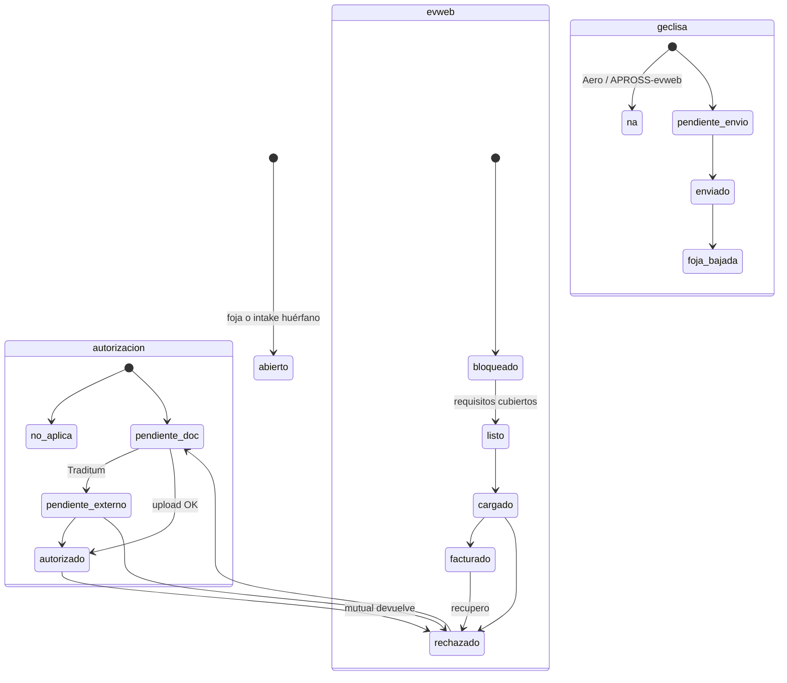
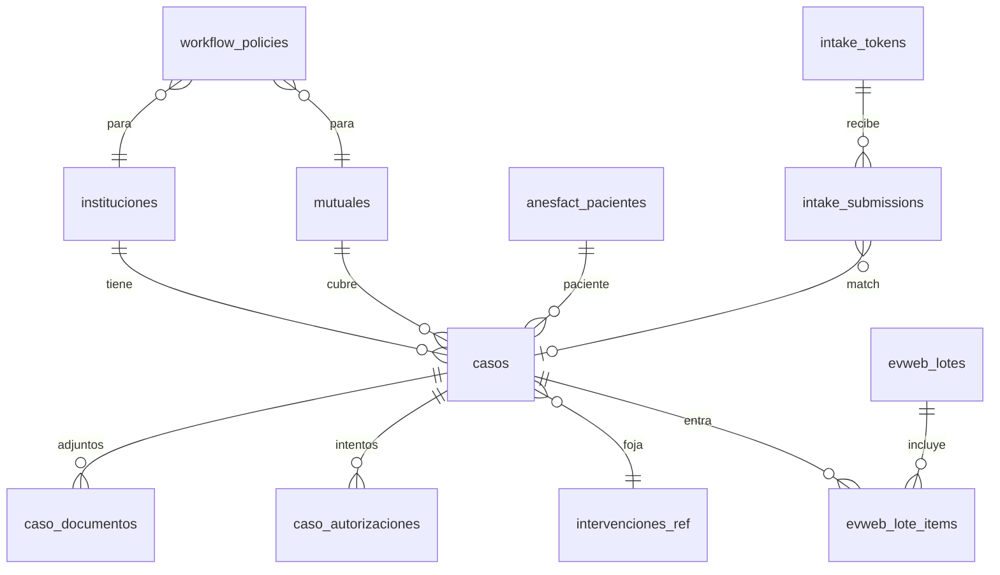

# AnesFact — Modelo de casos, autorizaciones y bandeja evweb

Revisión de arquitectura del brief de flujo post-OCR. **No implementar todavía**: este documento fija el modelo para el mapeo pantalla-a-pantalla de evweb y Traditum.

Estado: propuesta para validar. SQL de referencia en [`drafts/010_casos_workflow.sql`](drafts/010_casos_workflow.sql) — **no aplicar**.

---

## 0. Decisiones (tl;dr)

| # | Pregunta | Respuesta |
|---|----------|-----------|
| 1 | ¿Modelo de Caso? | Un `caso` (episodio quirúrgico) + **matriz de política** institución×mutual. Documentos y autorización son *slots* computados, no 4 flujos hardcodeados. |
| 2 | ¿Matching QR autorización? | DNI (hash) primero, n° afiliado segundo, fuzzy nombre+ventana de fecha tercero. Auto-vínculo solo si hay un candidato nítido; si no, bandeja de huérfanos. La autorización puede llegar **antes** que la foja. |
| 3 | ¿Uno o dos QR? | **Dos QR físicos** (Autorización / Apéndice cirugía), misma página de intake, el token lleva el `kind`. Un tercer QR ya existe y es otro público (paciente, valoración). |
| 4 | ¿Scraping Geclisa? | **No ahora.** El write path (bookmarklet + extensión) ya existe. El PDF “oficial” se baja a mano y se sube al slot `foja_geclisa`. Si más adelante se automatiza, que sea la extensión con la sesión de la doctora, no un scraper de servidor. |
| 5 | ¿Bandeja miércoles/viernes? | Vista computada sobre el caso (no un estado más). Filtros institución + mutual + columna de bandeja. El lote evweb es una entidad aparte. |
| 6 | ¿Borrado post-carga? | Job, no trigger. Borrar **solo después de `facturado` + N días**. Nunca en `cargado_evweb`. Si hay rechazo, se cancela el purge. El archivo original no vive en `anesfact_datos`. |

El cambio de diseño más importante respecto del brief: **no usar una máquina de estados lineal**. Autorización, Geclisa y evweb avanzan en paralelo. La bandeja se deriva.

---

## 1. Lo que el código ya es (vs. el brief)

El brief describe un stack y un flujo que **no coinciden** con este repo. Hay que diseñar sobre lo que existe.

| Brief | Repo actual |
|-------|-------------|
| React Native / Expo + Next.js | PWA vanilla (`index.html` + `views/` + `js/`), GitHub Pages |
| Claude Vision | Gemini 2.0 Flash Lite en `js/13-scan-ia.js` |
| Caso relacional | Intervención JSON en `localStorage` (`S.intervs`) sincronizada a `anesfact_datos` como blob |
| Storage de archivos en Supabase | Adjuntos `docs.anest` / `docs.qx` / `docs.auth` en **base64 dentro del JSON** |
| Estados RECIBIDO → … → FACTURADO | `preoperatorio \| borrador \| listo \| enviado \| enviado_geclisa \| enviado_evweb` |
| QR “Autorización” / “Apéndice cirugía” | QR de **valoración preanestésica del paciente** (`anesfact_qr_tokens`, 48 h Mayo / 30 días consultorio) |
| Geclisa sin API → ¿scraping? | Write path ya hecho: token de un uso + `fill.js` + extensión de cola |
| Keepalive “pedimos ping” | Ya hay Action 2×/día + `js/supabase-keepalive.js` |

Implicación: el trabajo de “caso → evweb” es una **capa nueva** al lado de la foja clínica, no un reemplazo de `S.intervs`. La foja sigue siendo la fuente clínica; el caso es el expediente de facturación.

Regla de oro heredada de [`VALORACION_QR.md`](VALORACION_QR.md): no romper fojas, no autollenar en silencio, PII cifrada.

---

## 2. Inconsistencias internas del brief

### 2.1 Una sola línea de estados no puede representar el trabajo real

```
RECIBIDO → DOCUMENTOS_COMPLETOS → EN_VALIDACION → PENDIENTE → AUTORIZADO → CARGADO_EVWEB → FACTURADO
```

Problemas:

- `DOCUMENTOS_COMPLETOS` depende de la mutual (APROSS: cero fojas; PAMI: dos fojas y sin autorización; ART: dos fojas + archivo).
- `EN_VALIDACION` / `PENDIENTE` / `AUTORIZADO` no aplican a PAMI.
- Traditum “puede tardar días sin bloquear el resto” **no es un estado siguiente**: es una pista paralela. Si PENDIENTE es un valor de `casos.estado`, la bandeja evweb tiene que filtrarlo a mano en cada query. Si es un campo aparte, cae solo.
- En Mayo, “enviado a Geclisa” ya es un hito operativo y no aparece en esa cadena.
- La autorización (ART, obras) a menudo **llega antes** que la foja. `RECIBIDO` no puede asumir que el caso ya existe.

### 2.2 “Fuente de la foja” ≠ “fuente del caso”

En Mayo, Geclisa es la foja que se sube a evweb. AnesFact sigue siendo la **fuente del expediente de facturación** (quién es el paciente, qué falta, qué se matcheó). Mezclar las dos hace imposible el matching: el caso tiene que existir en AnesFact **antes** de bajar nada de Geclisa.

### 2.3 APROSS vs. el flujo Mayo

El eje mutual dice “APROSS: ninguna foja”. El flujo Mayo dice “bajar foja real de Geclisa (salvo APROSS)”. Hay que explicitar:

- La foja de **trabajo** AnesFact se sigue cargando en Geclisa (historia del sanatorio).
- A evweb, APROSS no lleva esas fojas: lleva datos de paciente + complejidad + autorización Traditum.

Si eso es correcto, el slot `foja_geclisa` es `required_for_evweb = false` en APROSS, no “no existe Geclisa”.

### 2.4 Aeronáutico: ¿autorización siempre?

El flujo Aero dice “autorización cargada por foto (HC en papel)” para todos. El eje mutual dice que PAMI no lleva autorización. ¿La foto de HC en Aero es el sustituto de autorización para **todas** las mutuales, o solo cuando la mutual la pide?

Propuesta por defecto (validar): en Aero, `auth_mode = upload` salvo PAMI (`none`). La HC papel entra al slot `autorizacion` cuando hace falta.

### 2.5 “2 QR fijos” vs. apéndice cirugía “clave en Aeronáutico”

En Mayo la foja qx verdadera sale de Geclisa: el QR de apéndice cirugía **no debería estar pegado ahí**. En Aero sí. Los QR físicos se despliegan por institución, no como un par universal.

Además ya hay un QR de valoración (público: paciente). No reutilizar esos tokens para secretarias.

### 2.6 Matching “nombre + fecha”

El repo ya cifra nombre/DNI y busca por `dni_hash`. Nombre+fecha es el peor de los tres anclas (homónimos, OCR de “GARCIA” vs “GARCÍA”, fecha de autorización ≠ fecha de cirugía). DNI primero.

### 2.7 Borrar el original en `CARGADO_EVWEB`

Si evweb o la mutual rechazan **después** de marcar cargado, el archivo ya no está. `CARGADO_EVWEB` es “lo subimos”; `FACTURADO` es “cerró”. El original se necesita entre esos dos.

### 2.8 Traditum no es “subir un PDF”

El QR Autorización puede recibir el comprobante/pantallazo, pero la validación de complejidad usa **el usuario de la anestesista en Traditum**. Eso no lo cierra la secretaria con un upload. No guardar ni automatizar esas credenciales. El caso queda `auth_status = pending_external` hasta que alguien marque autorizado (o adjunte el comprobante final) en la revisión miércoles/viernes.

### 2.9 Checklist evweb actual está muerto

En `js/11-resumen.js` los ítems foja qx / autorización / subida a evweb arrancan en `done: false` siempre. La bandeja nueva tiene que derivar esos checks de slots reales, no de checkboxes locales.

---

## 3. Principio: matriz de política, no 4 flujos

Institución y mutual son **ejes independientes**. El código pregunta a una tabla (o JSON de config versionado) qué hace falta para *este* par. Agregar “Sanatorio X” o “OSDE con autorización Geclisa” es una fila, no un `if`.

```
                    requiere_foja_anest   requiere_foja_qx   foja_evweb_desde     auth_mode
PAMI + cualquiera   sí                    sí                 institucion.fuente   none
APROSS + Mayo       no (para evweb)       no (para evweb)    —                    traditum
ART + cualquiera    sí                    sí                 institucion.fuente   upload
OS varias + Mayo    sí                    sí                 geclisa              geclisa
OS varias + Aero    sí                    sí                 anesfact             upload
```

`institucion.fuente_foja_evweb`: `anesfact` | `geclisa` | `ninguna`.

`auth_mode`:

| Valor | Qué entra al slot | Quién cierra |
|-------|-------------------|--------------|
| `none` | nada | el sistema (PAMI) |
| `upload` | foto/PDF (WhatsApp, mail, HC papel) | OCR + match, o secretaria confirma |
| `traditum` | comprobante opcional; el hecho es la validación externa | anestesista / revisión periódica |
| `geclisa` | no hay archivo en AnesFact; hay un flag “visto en Geclisa” o captura | humano, hasta que la extensión pueda ayudar |

La foja de trabajo AnesFact (`intervencion`) sigue existiendo aunque `requiere_foja_*` para evweb sea false.

---

## 4. Máquina de estados: tres pistas + una bandeja derivada



Campos en `casos` (no un enum único):

- `auth_status`: `no_aplica | pendiente_doc | pendiente_externo | autorizado | rechazado`
- `geclisa_status`: `no_aplica | pendiente_envio | enviado | foja_bajada`
- `evweb_status`: `bloqueado | listo | cargado | facturado | rechazado`
- `caso_status`: `abierto | cerrado | anulado` (el expediente vive o no)

`bandeja` es una columna **generada** (SQL o vista):

| bandeja | Regla |
|---------|--------|
| `huerfanos` | intake sin `caso_id` |
| `faltan_documentos` | falta slot required |
| `esperando_autorizacion` | `auth_status` ∈ {pendiente_doc, pendiente_externo, rechazado} |
| `esperando_geclisa` | Mayo y `geclisa_status` ≠ foja_bajada (salvo APROSS) |
| `listo_evweb` | `evweb_status = listo` |
| `cargado` | `evweb_status = cargado` |
| `facturado` | `evweb_status = facturado` |
| `rechazado_evweb` | `evweb_status = rechazado` |

Traditum vive en `esperando_autorizacion` y **no tapa** `listo_evweb` de otros casos. La revisión miércoles/viernes abre dos colas: “cargar evweb” y “seguir Traditum / pendientes viejos”.

Estados actuales de la foja (`borrador`, `enviado_geclisa`, …) **se quedan en la intervención**. El caso los lee; no los pisa. Migración sugerida:

- `enviado_geclisa` → `geclisa_status = enviado`
- `enviado_evweb` → `evweb_status = cargado` (aprox.; no implica facturado)
- `listo` / `borrador` → el caso se crea cuando hay identidad mínima (paciente + fecha + institución)

---

## 5. Modelo de datos

### 5.1 Entidades



**No** meter el PDF en `anesfact_datos`. Eso ya infla el blob de sync y el free tier de DB (500 MB), no el de Storage (1 GB).

Identidad: reutilizar `anesfact_pacientes` (nombre/DNI cifrados, `dni_hash`). El caso apunta a `paciente_id` + `interv_id` (texto, como `anesfact_foja_vinculos`).

### 5.2 Tablas (resumen)

`instituciones` — `codigo` (`mayo`, `aero`, …), `usa_geclisa`, `fuente_foja_evweb`.

`mutuales` — `codigo` (`pami`, `apross`, `art`, `os_varias`, …), `auth_mode` por defecto, flags de fojas. “Obras sociales varias” es **una** mutual de política, no una fila por OSDE/IOSFA. El nombre concreto de la OS va en `casos.obra_social` (texto, el catálogo actual).

`workflow_policies` — PK `(institucion_id, mutual_id)` + JSON de requisitos. Override puntual gana al default de la mutual.

`casos` — episodio: owner, institución, mutual, paciente, fecha cirugía, obra_social, afiliado (cifrado o hash), complejidad, los tres status, `interv_id`, timestamps.

`caso_documentos` — `kind` abierto:

- `foja_anest_anesfact` — trabajo / impresión AnesFact
- `foja_qx_anesfact` — apéndice cirugía (Aero)
- `foja_geclisa` — PDF bajado de Geclisa (Mayo, salvo APROSS)
- `autorizacion` — Traditum / ART / OS / HC papel
- `otro`

Campos: `storage_path`, `sha256`, `extracted jsonb`, `ocr_confianza`, `purged_at`, `purge_after`. Varios archivos del mismo `kind` (reintento); el “vigente” es `is_current`.

`caso_autorizaciones` — historial: canal (`upload|traditum|geclisa|manual`), `status`, `complejidad_solicitada`, `complejidad_autorizada`, notas. Traditum de 4 días = una fila `pending` que no bloquea a nadie.

`intake_tokens` — QR de secretaria, **larga vida**, `kind` (`autorizacion` | `foja_qx`), `institucion_id`, PIN opcional, `revocado_at`. Distintos de `anesfact_qr_tokens` (paciente, un uso / consultorio).

`intake_submissions` — lo que entra por el QR **antes** del match: archivo en Storage, OCR JSON, `caso_id` nullable, `match_score`, `match_reason`, `estado` (`recibido|matcheado|ambiguo|sin_caso|descartado`).

`evweb_lotes` — `fecha_sesion` (mié/vie), institución, creado_por, `cerrado_at`.

`evweb_lote_items` — `caso_id`, resultado (`cargado|salteado|error`), nota.

### 5.3 Por qué no 4 flujos

Un caso nuevo no elige “flujo APROSS”. Elige institución + mutual. Un trigger/`BEFORE INSERT` copia los requisitos vigentes a `casos.requisitos_snapshot` (JSONB) para que un cambio de política no reescriba casos viejos.

Ejemplo de snapshot:

```json
{
  "version": 1,
  "slots": {
    "foja_anest_anesfact": { "required_for_evweb": false, "required_for_geclisa": true },
    "foja_qx_anesfact":     { "required_for_evweb": false, "required_for_geclisa": false },
    "foja_geclisa":         { "required_for_evweb": false },
    "autorizacion":         { "required_for_evweb": true, "auth_mode": "traditum" }
  }
}
```

APROSS+Mayo vs PAMI+Aero son dos snapshots, misma tabla, misma UI de bandeja.

### 5.4 Relación con la foja actual

| Hoy | Mañana |
|-----|--------|
| `S.cur` / `anesfact_datos` | Sigue. Es la foja clínica. |
| `anesfact_foja_vinculos` | Sigue. Caso nuevo apunta al mismo `interv_id`. |
| `S.cur.docs.{anest,qx,auth}` base64 | Migrar a Storage + `caso_documentos`; dejar de meter binarios en el blob de sync. |
| Home filtros estado/sanatorio | Home clínica **más** vista Bandeja (puede ser la misma lista con un toggle). |

Creación del caso (idempótica): al guardar una intervención con paciente + fecha + sanatorio, upsert `casos` por `(owner_id, interv_id)`. Un intake huérfano crea caso **stub** (`interv_id` null) hasta que alguien vincule la foja.

---

## 6. Matching automático (QR Autorización)

### 6.1 Orden de anclas

El volumen es de decenas de casos/semana, no millones. El nombre está cifrado: **no** hay `pg_trgm` útil sobre ciphertext. El Edge Function (service role) filtra y descifra un set chico.

1. **DNI normalizado** → `dni_hash` (ya existe `af_normalize_dni`). Score 1.00 si único en ventana.
2. **N° afiliado** (normalizado, hash). Score 0.93 si único.
3. **Nombre plegado** (sin tildes, `APELLIDO NOMBRE`) + **ventana de fecha ±3 días** sobre `casos.fecha_cirugia` y `intervenciones.fecha`. Jaro-Winkler / Levenshtein en memoria sobre ≤ ~40 candidatos. Score 0.55–0.90.
4. Misma **institución** del token QR (un upload en Mayo no matchea Aero).

Auto-vínculo solo si:

- hay **un** candidato con score ≥ 0.92, y
- el segundo está ≥ 0.15 por debajo, y
- DNI o afiliado coinciden, **o** nombre ≥ 0.88 **y** fecha exacta.

Si no: `intake_submissions.estado = ambiguo | sin_caso` y la secretaria ve 1–3 candidatos (nombre, fecha, mutual — **sin** foja clínica).

Nunca auto-merge solo por apellido.

### 6.2 La autorización puede llegar primero

Si no hay caso: crear **stub** (`origen = intake_auth`, `auth_status = autorizado` o `pendiente_externo` según el OCR) y dejarlo en `huerfanos` / `faltan_documentos`. Cuando se carga la foja, el mismo matcher corre al revés (caso nuevo busca submissions huérfanas).

### 6.3 OCR

Prompt distinto al de `js/13-scan-ia.js` (ese mezcla foja + autorización). Extraer solo: paciente, DNI, afiliado, obra social, fecha, prestador, complejidad, n° autorización, tipo de documento inferido. Guardar `extracted` + `confianza` + `dudosos`.

Gemini (hoy) o Claude (brief): da igual para el modelo de datos. La función `af-intake-submit` llama al proveedor; no acoplar la tabla al vendor.

### 6.4 Actor nuevo: secretaria

Hoy la app es la anestesista. El QR de intake es público con token. La secretaria **no** necesita cuenta para subir. Sí hace falta cuenta (rol `secretaria`, scoped a institución) para la bandeja de ambiguos y para marcar “visto en Geclisa”. Si eso es demasiado para el MVP: la doctora confirma matches en la revisión mié/vie y el QR solo deja huérfanos.

Recomendación MVP: QR anónimo + PIN de 4 dígitos rotables + confirmación de match por la anestesista. Fase 2: usuario secretaria.

---

## 7. QR: dos físicos, un backend

**Dos carteles** en el mostrador. Motivo: la secretaria está con un PDF de WhatsApp en una mano; un selector “tipo de documento” en el teléfono es el error más barato (subir Traditum como foja qx). El token ya trae el `kind`.

Misma ruta: `/intake?t=<token>`. El token es de larga duración, atado a institución, revocable. Rotar el cartel = revocar + imprimir de nuevo (no hace falta tocar código).

| Institución | Cartel Autorización | Cartel Apéndice qx |
|-------------|---------------------|--------------------|
| Mayo | Sí | No (Geclisa) |
| Aero | Sí (HC / mutual) | Sí |

No mezclar con el QR de valoración del paciente (otro público, otro TTL, otro formulario, cifrado distinto).

Un QR único con selector solo tendría sentido si hubiera un tercer tipo frecuente. Hoy no.

---

## 8. Geclisa: no scrapear ahora

Ya hay tres piezas alineadas con “usuario en el loop”:

1. Token de un uso 2 h (`anesfact_geclisa_tokens`)
2. `fill.js` pega campos
3. Extensión de cola: llena, **pausa**, la doctora guarda

Eso cubre el **write**. El brief pide **read** (bajar la foja real). Opciones:

| Opción | Cuándo |
|--------|--------|
| A. Bajar PDF en Geclisa y subirlo al slot `foja_geclisa` (QR o desde la app) | **MVP** |
| B. Extensión: botón “Imprimir/PDF” → sube al slot con la sesión ya abierta | Cuando el click sea estable y haya consentimiento del sanatorio |
| C. Scraper server-side con user/pass | No. ToS, credentials, DOM frágil, secretos en Edge, peor en free tier |

El bookmarklet/extensión **no** es scraping oculto: opera con la sesión humana. C (servidor) sí lo es.

Formulario prellenado / copiar-pegar (`js/11-resumen.js`) se queda para **evweb** (tampoco hay API). Mismo patrón: humano pega, AnesFact no finge que cargó.

---

## 9. Bandeja “listo para evweb”

No es una tabla: es `VIEW` (o query en Edge) sobre `casos` + slots.

Pantalla (miércoles/viernes):

1. Filtros: institución, mutual, bandeja, rango de fechas, “solo míos”.
2. Columnas: paciente, fecha, OS, bandeja, faltantes (chips: qx, auth, geclisa), días en `pendiente_externo`, complejidad.
3. Agrupar por institución, luego mutual. Traditum al fondo o en pestaña “Pendientes largos”, no mezclado con los listos.
4. Acción “Abrir lote de hoy”: crea `evweb_lotes`, tilda casos `listo` → al marcar cada uno `cargado`, entra al lote.
5. Un caso en Traditum **no** entra al lote. Sigue visible. No bloquea el resto.

Home actual puede ganar un filtro `bandeja=listo_evweb` sin esperar una app nueva.

---

## 10. Retención de archivos (free tier)

### 10.1 El problema real no es el histórico de Storage

Storage cuenta **ocupación actual**. El blob `anesfact_datos` + `localStorage` con JPEG en base64 es ~33 % más pesado que el archivo y **no** se libera al “borrar el original” si el original está en el JSON. Primera migración: archivos a bucket privado `casos-docs`, en el JSON solo `storage_path`.

Nunca commitear fotos de pacientes (ya dicho; el riesgo actual es el sync blob, no Git).

### 10.2 Política

```
al pasar a evweb_status = facturado:
  purge_after = now() + 14 días   -- configurable
  NO borrar todavía

job cada 6 h:
  si purge_after < now()
  y evweb_status sigue facturado
  y no hay rechazo abierto:
    Storage.remove(path)
    purged_at = now()
    extracted jsonb SE QUEDA
```

Si el caso vuelve a `rechazado` o `listo`: `purge_after = null`. Si `purged_at` ya está, el JSON alcanza para rearmar evweb; si hace falta el PDF, re-upload por QR (el slot admite otra versión `is_current`).

**No** usar un trigger `AFTER UPDATE` para borrar en Storage. Postgres no habla con Storage de forma fiable. Trigger **sí** para setear `purge_after`. El delete lo hace:

- `pg_cron` + Edge Function `af-docs-purge`, o
- el mismo GitHub Action de keepalive, un step extra autenticado con service role (más simple en free tier, sin `pg_cron` de pago).

Keepalive actual ya pinea `anesfact_datos`. El job de purge puede vivir al lado.

### 10.3 Qué no borrar

- `extracted` (JSON de OCR / foja estructurada)
- metadatos, hashes, historial de autorización
- el caso y la intervención

Thumbnails: no. Sobran si hay JSON y duelen en 1 GB.

---

## 11. Seguridad y PII

- Bucket no público. URLs firmadas, TTL corto.
- Intake: Edge Function valida token + PIN + tamaño MIME (imagen/PDF, tope ~8 MB).
- OCR en memoria; no loguear el base64.
- Nombre/DNI del intake se cifran igual que `anesfact_pacientes` antes de persistir.
- Secretaria (si hay login) no lee `anesfact_datos` ni vitals.
- RLS: `casos.owner_id = auth.uid()` **o** membresía `institucion_miembros`. Admin igual que hoy (`af_is_admin`), sin “ver fojas ajenas”.
- Traditum: ni usuario ni password en AnesFact.

---

## 12. Orden de implementación (cuando se apruebe)

1. Config: `instituciones`, `mutuales`, `workflow_policies` + snapshot al crear caso. Sin UI nueva: seed SQL Mayo/Aero × PAMI/APROSS/ART/os_varias.
2. `casos` upsert desde la intervención actual. Home muestra `bandeja` derivada. Aún sin Storage.
3. Sacar `docs.*` base64 → Storage + `caso_documentos`. Purge job en el Action de keepalive, **inactivo** hasta `facturado`.
4. QR Autorización + `intake_submissions` + matcher + bandeja huérfanos/ambiguos.
5. Apéndice qx (Aero) — mismo intake, otro token.
6. Lotes mié/vie + marcar `cargado` / `facturado`.
7. (Opcional) Extensión Geclisa: subir PDF al slot. No scraper.

No hace falta Next.js ni Expo para esto. La PWA + Edge Functions cubren intake y bandeja.

---

## 13. Preguntas que el modelo no puede cerrar solo

1. Aero + PAMI: ¿se adjunta igual la HC papel, o PAMI es sin autorización también en Aero?
2. APROSS + Mayo: ¿la foja AnesFact se manda a Geclisa igual (historia) aunque evweb no la pida?
3. ¿Quién confirma matches ambiguos en el MVP: secretaria con login, o solo la doctora?
4. Traditum: ¿la secretaria deja el comprobante y la doctora valida complejidad, o la secretaria opera Traditum con usuario de la doctora? (Lo segundo no debería entrar al producto.)
5. Rechazo de mutual: ¿hay que re-subir el mismo PDF a evweb, o alcanza el JSON + reimpresión AnesFact?
6. ¿Un paciente dos cirugías el mismo día (dos equipos) es un caso o dos? Propuesta: **dos** `casos` (dos `interv_id`).

Con esas respuestas se puede mapear evweb/Traditum pantalla a pantalla sin reabrir el esquema.
