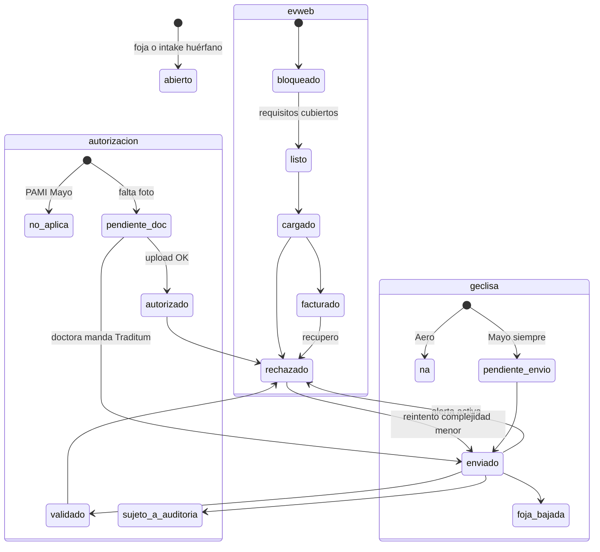
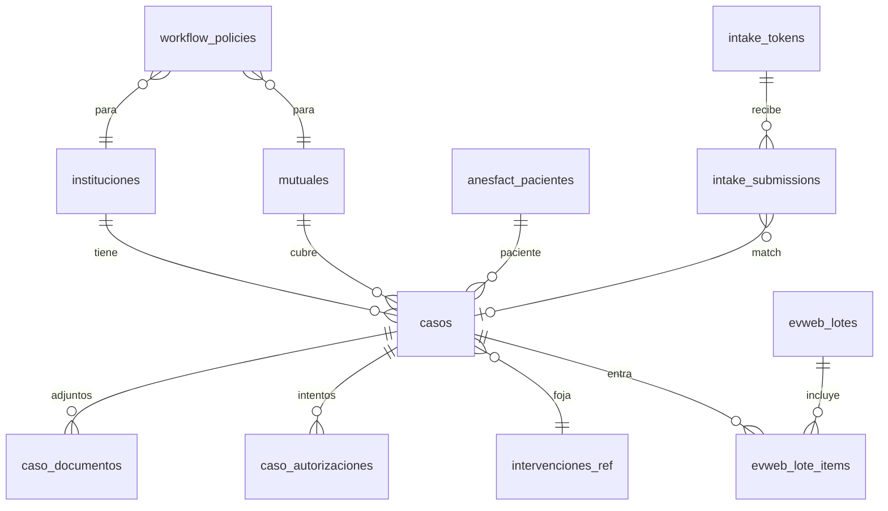

# AnesFact — Modelo de casos, autorizaciones y bandeja evweb

Revisión de arquitectura del flujo post-OCR. **No implementar todavía**: el siguiente paso es mapear pantalla a pantalla evweb y Traditum sobre este esquema.

Estado: **cerrado** (PR #7 + respuestas del 24-08-2026). SQL de referencia en [`drafts/010_casos_workflow.sql`](drafts/010_casos_workflow.sql) — **no aplicar** hasta ese mapeo.

---

## 0. Decisiones (tl;dr)

| # | Pregunta | Respuesta |
|---|----------|-----------|
| 1 | ¿Modelo de Caso? | Un `caso` (episodio quirúrgico) + **matriz de política** institución×mutual. Documentos y autorización son *slots* computados, no 4 flujos hardcodeados. |
| 2 | ¿Matching QR autorización? | DNI (hash) primero, n° afiliado segundo, fuzzy nombre+ventana de fecha tercero. Auto-vínculo solo si hay un candidato nítido; si no, bandeja de huérfanos. La autorización puede llegar **antes** que la foja. **Los ambiguos los resuelve la anestesista** (bandeja mié/vie), no la secretaria. |
| 3 | ¿Uno o dos QR? | **Dos QR físicos** (Autorización / Apéndice cirugía), misma página de intake, el token lleva el `kind`. Un tercer QR ya existe y es otro público (paciente, valoración). |
| 4 | ¿Scraping Geclisa? | **No ahora.** El write path (bookmarklet + extensión) ya existe. El PDF “oficial” se baja a mano y se sube al slot `foja_geclisa`. Si más adelante se automatiza, que sea la extensión con la sesión de la doctora, no un scraper de servidor. |
| 5 | ¿Bandeja miércoles/viernes? | Vista computada sobre el caso (no un estado más). Filtros institución + mutual + columna de bandeja. El lote evweb es una entidad aparte. Huérfanos y Traditum `rechazado` van a esa revisión, dirigidos a la doctora. |
| 6 | ¿Borrado post-carga? | Job, no trigger. **Autorización:** purge apenas se confirma el OCR. **Foja:** 14 días después de `facturado`. Un rechazo cancela cualquier purge pendiente. El archivo original no vive en `anesfact_datos`. |

El cambio de diseño más importante respecto del brief original: **no usar una máquina de estados lineal**. Autorización, Geclisa y evweb avanzan en paralelo. La bandeja se deriva.

### Cierre de producto (24-08-2026)

| Decisión | Valor cerrado |
|----------|----------------|
| Geclisa | Siempre que la institución tenga Geclisa (Mayo). **No** depende de la mutual. `geclisa_status` avanza por institución. |
| Aero + PAMI | **No existe.** Aeronáutico atiende IOSFA, no PAMI. Se saca esa celda de la matriz. |
| Huérfanos | Los resuelve la anestesista. Única persona con criterio clínico. |
| Traditum | Lo opera la doctora con **su** usuario. Nunca se comparte con la secretaria. El envío es una acción del producto (payload `cirugia_autorizada`); ella se autentica en Traditum, igual que Geclisa/evweb. |
| Rechazo de mutual | ~3 en 5 años. No hace falta conservar el PDF original. De la autorización solo se guardan los datos extraídos. |
| Dos cirugías el mismo día | **Dos casos** (dos `interv_id`). |
| Dato Traditum ≠ dato real | El caso guarda `cirugia_clinica` (foja / evweb) y `cirugia_autorizada` (envío Traditum). No se concilian. Flag de discrepancia en UI. |
| Flujo Aero | El más corto: foja anestesia + foja cirugía (ambas nativas AnesFact) + foto de autorización → listo evweb. Sin Geclisa, sin Traditum. Se imprimen para la HC papel; evweb come la versión digital. |
| Cuota Supabase | Job diario (puede ir en el Action de keepalive): alerta al 70 % de storage / DB / egress; alerta fuerte storage al 90 %. |

---

## 1. Lo que el código ya es (vs. el brief original)

El brief describía un stack y un flujo que **no coinciden** con este repo. Se diseña sobre lo que existe.

| Brief original | Repo actual |
|----------------|-------------|
| React Native / Expo + Next.js | PWA vanilla (`index.html` + `views/` + `js/`), GitHub Pages |
| Claude Vision | Gemini 2.0 Flash Lite en `js/13-scan-ia.js` |
| Caso relacional | Intervención JSON en `localStorage` (`S.intervs`) sincronizada a `anesfact_datos` como blob |
| Storage de archivos en Supabase | Adjuntos `docs.anest` / `docs.qx` / `docs.auth` en **base64 dentro del JSON** |
| Estados RECIBIDO → … → FACTURADO | `preoperatorio \| borrador \| listo \| enviado \| enviado_geclisa \| enviado_evweb` |
| QR “Autorización” / “Apéndice cirugía” | QR de **valoración preanestésica del paciente** (`anesfact_qr_tokens`, 48 h Mayo / 30 días consultorio) |
| Geclisa sin API → ¿scraping? | Write path ya hecho: token de un uso + `fill.js` + extensión de cola |
| Keepalive “pedimos ping” | Ya hay Action 2×/día + `js/supabase-keepalive.js` |

Implicación: el trabajo de “caso → evweb” es una **capa nueva** al lado de la foja clínica, no un reemplazo de `S.intervs`. La foja sigue siendo la fuente clínica; el caso es el expediente de facturación.

Regla de oro heredada de [`VALORACION_QR.md`](VALORACION_QR.md): no romper fojas, no autollenar en silencio, PII cifrada.

---

## 2. Inconsistencias del brief original (y cómo quedaron)

### 2.1 Una sola línea de estados no representa el trabajo real

```
RECIBIDO → DOCUMENTOS_COMPLETOS → EN_VALIDACION → PENDIENTE → AUTORIZADO → CARGADO_EVWEB → FACTURADO
```

Sigue descartada. Traditum, PAMI, APROSS y “la autorización llegó antes” no caben en una cola. Ver §4.

### 2.2 “Fuente de la foja” ≠ “fuente del caso”

En Mayo, Geclisa es la foja que se sube a evweb (salvo APROSS). AnesFact sigue siendo la **fuente del expediente de facturación**. El caso tiene que existir en AnesFact **antes** de bajar nada de Geclisa.

### 2.3 Geclisa se dispara por institución, no por mutual — cerrado

Siempre que la institución sea Sanatorio Mayo (o cualquier otra con Geclisa). Es registro/automatización del sanatorio, independiente del camino a evweb.

- APROSS: igual se manda la foja a Geclisa (HC). A evweb no lleva esas fojas: paciente + complejidad + Traditum.
- Slot `foja_geclisa`: `required_for_evweb = false` en APROSS; `required_for_geclisa` no aplica — el envío Geclisa es el hito `geclisa_status`, no un PDF obligatorio para facturar.

### 2.4 Aeronáutico no atiende PAMI — cerrado

Atiende **IOSFA**. No hay celda Aero×PAMI. En Aero, IOSFA lleva foto de autorización (`auth_mode = upload`). Flujo completo en §3.

### 2.5 QR de apéndice cirugía: solo donde AnesFact es nativo

En Mayo la foja qx verdadera sale de Geclisa: ese cartel **no** se pega ahí. En Aero sí (hay que construir el formulario). Los QR físicos se despliegan por institución.

No reutilizar el QR de valoración del paciente.

### 2.6 Matching “nombre + fecha”

El repo ya cifra nombre/DNI y busca por `dni_hash`. Nombre+fecha es el peor ancla. DNI primero. Huérfanos: la doctora, no la secretaria.

### 2.7 Purge — corregido

No se espera a `facturado` para la **autorización**: el PDF se borra cuando el OCR está confirmado. Las fojas sí esperan 14 días post-`facturado`. Un rechazo cancela purge **pendiente**; si la autorización ya se purgó, alcanzan los datos extraídos (3 rechazos en 5 años).

### 2.8 Traditum no es “subir un PDF”

El QR puede recibir el comprobante. La validación de complejidad la hace la doctora **dentro del producto**, con su usuario en Traditum. AnesFact arma el payload con `cirugia_autorizada` (no con el dato clínico real). No se guardan credenciales.

### 2.9 Checklist evweb actual está muerto

En `js/11-resumen.js` los ítems foja qx / autorización / subida a evweb arrancan en `done: false` siempre. La bandeja nueva deriva esos checks de slots reales.

---

## 3. Matriz institución × mutual (cerrada)

Institución y mutual son ejes independientes. El código pregunta a `workflow_policies`. Agregar un sanatorio o una OS es una fila, no un `if`. **No hay política Aero×PAMI.**

| Institución | Mutuales | Geclisa | Camino a evweb |
|-------------|----------|---------|----------------|
| **Aeronáutico** | IOSFA (no PAMI) | No aplica — no existe | Foja anestesia + foja cirugía (ambas nativas AnesFact) + foto de autorización → `listo_evweb`. Sin Traditum. Se imprimen para la HC papel; evweb usa la digital. |
| **Sanatorio Mayo** | PAMI, APROSS, ART, obras varias | **Sí, siempre**, independiente de la mutual | Según mutual: PAMI sin autorización / APROSS vía Traditum (sub-estados) / ART vía QR upload / obras varias autorización en Geclisa |

`institucion.fuente_foja_evweb`: `anesfact` (Aero) | `geclisa` (Mayo, salvo APROSS que para evweb es `ninguna`).

`auth_mode`:

| Valor | Dónde | Qué entra al slot | Quién cierra |
|-------|-------|-------------------|--------------|
| `none` | PAMI Mayo | nada | el sistema |
| `upload` | Aero IOSFA, ART Mayo | foto/PDF | OCR + match; ambiguos → doctora |
| `traditum` | APROSS Mayo | comprobante opcional; el hecho es el envío | **solo la doctora** |
| `geclisa` | obras varias Mayo | flag “visto en Geclisa” o captura | humano, hasta que la extensión pueda ayudar |

La foja de trabajo AnesFact (`intervencion`) se manda a Geclisa en Mayo **aunque** evweb no pida esas fojas.

---

## 4. Máquina de estados: tres pistas + una bandeja derivada



Campos en `casos` (no un enum único):

- `auth_status`: `no_aplica | pendiente_doc | enviado | validado | sujeto_a_auditoria | autorizado | rechazado`
- `geclisa_status`: `no_aplica | pendiente_envio | enviado | foja_bajada` — en Mayo arranca en `pendiente_envio` **para toda mutual**
- `evweb_status`: `bloqueado | listo | cargado | facturado | rechazado`
- `caso_status`: `abierto | cerrado | anulado`

### Sub-estados Traditum (APROSS)

Después de `enviado`:

| Resultado | Efecto | UI |
|-----------|--------|----|
| `validado` | puede pasar a `listo_evweb` | silencioso |
| `sujeto_a_auditoria` | espera pasiva; **no** desbloquea evweb de *este* caso; **no** tapa a los demás | silencioso, pestaña “pendientes largos” |
| `rechazado` | **alerta activa** a la doctora (marca en bandeja; push más adelante) | ella baja complejidad y reintenta `enviado` |

`autorizado` es el cierre del camino **upload** (Aero / ART). `validado` es el cierre **Traditum**. Ambos pueden desbloquear `listo_evweb` si el resto de slots está.

`bandeja` es columna **generada**:

| bandeja | Regla |
|---------|--------|
| `huerfanos` | intake sin `caso_id` **o** match `ambiguo` — los ve la doctora mié/vie |
| `faltan_documentos` | falta slot required |
| `esperando_autorizacion` | `auth_status` ∈ {pendiente_doc, enviado, sujeto_a_auditoria} |
| `alerta_auth` | `auth_status = rechazado` (no mezclar con la espera silenciosa) |
| `esperando_geclisa` | Mayo y `geclisa_status` ∈ {pendiente_envio, enviado} — **no** bloquea `listo_evweb` en APROSS |
| `listo_evweb` | `evweb_status = listo` |
| `cargado` / `facturado` / `rechazado_evweb` | según `evweb_status` |

La revisión miércoles/viernes abre: (1) cargar evweb, (2) huérfanos, (3) alerta Traditum, (4) pendientes largos (`sujeto_a_auditoria`). (2) y (3) son para la doctora.

Estados actuales de la foja se quedan en la intervención. Migración: `enviado_geclisa` → `geclisa_status = enviado`; `enviado_evweb` → `evweb_status = cargado`.

---

## 5. Modelo de datos

### 5.1 Entidades



**No** meter el PDF en `anesfact_datos`.

Identidad: `anesfact_pacientes` (nombre/DNI cifrados, `dni_hash`). El caso apunta a `paciente_id` + `interv_id`. Dos cirugías el mismo día = dos `interv_id` = dos casos.

### 5.2 Tablas (resumen)

`instituciones` — `mayo` (`usa_geclisa=true`, `fuente_foja_evweb=geclisa`), `aero` (`usa_geclisa=false`, `fuente_foja_evweb=anesfact`).

`mutuales` — `pami`, `apross`, `art`, `iosfa`, `os_varias`. “Obras varias” agrupa OSDE/etc. El nombre concreto va en `casos.obra_social`. IOSFA en Aero es fila propia (upload); en Mayo cae en `os_varias` (auth en Geclisa) salvo que más adelante se especialice.

`workflow_policies` — PK `(institucion_id, mutual_id)`. **Sin fila Aero×PAMI.**

`casos` — además de status y FKs:

- `cirugia_clinica jsonb` — lo que hizo la doctora (foja / evweb)
- `cirugia_autorizada jsonb` — lo que dice el papel Traditum (envío de validación)
- No se concilian. UI: ambos + flag si difieren. Traditum **siempre** usa `cirugia_autorizada`.

`caso_documentos` — `kind`: `foja_anest_anesfact` | `foja_qx_anesfact` | `foja_geclisa` | `autorizacion` | `otro`. Varias versiones; `is_current` es la vigente. `extracted` se queda al purgar.

`caso_autorizaciones` — historial de intentos Traditum/upload (`enviado` / `validado` / `sujeto_a_auditoria` / `rechazado`), complejidad solicitada vs autorizada.

`intake_tokens` / `intake_submissions` — QR secretaria, larga vida, distintos de `anesfact_qr_tokens`.

`evweb_lotes` / `evweb_lote_items` — sesión mié/vie.

`institucion_miembros` — fase 2. MVP: la secretaria sube por QR+PIN; no confirma matches.

### 5.3 Snapshot de requisitos

Al insertar el caso se copia la política vigente a `requisitos_snapshot` para que un cambio futuro no reescriba casos viejos.

Ejemplo APROSS+Mayo:

```json
{
  "version": 1,
  "slots": {
    "foja_anest_anesfact": { "required_for_evweb": false },
    "foja_qx_anesfact":     { "required_for_evweb": false },
    "foja_geclisa":         { "required_for_evweb": false },
    "autorizacion":         { "required_for_evweb": true, "auth_mode": "traditum" }
  },
  "geclisa": { "required": true }
}
```

Ejemplo Aero×IOSFA:

```json
{
  "version": 1,
  "slots": {
    "foja_anest_anesfact": { "required_for_evweb": true },
    "foja_qx_anesfact":     { "required_for_evweb": true },
    "foja_geclisa":         { "required_for_evweb": false },
    "autorizacion":         { "required_for_evweb": true, "auth_mode": "upload" }
  },
  "geclisa": { "required": false }
}
```

### 5.4 Relación con la foja actual

| Hoy | Mañana |
|-----|--------|
| `S.cur` / `anesfact_datos` | Sigue. Es la foja clínica → alimenta `cirugia_clinica`. |
| `anesfact_foja_vinculos` | Sigue. Caso apunta al mismo `interv_id`. |
| `S.cur.docs.{anest,qx,auth}` base64 | Migrar a Storage + `caso_documentos`. |
| Home filtros | Home clínica **más** vista Bandeja. |

Upsert del caso al guardar una intervención con paciente + fecha + sanatorio, clave `(owner_id, interv_id)`. Intake huérfano: caso stub (`interv_id` null) hasta que la doctora vincule.

---

## 6. Matching automático (QR Autorización)

### 6.1 Orden de anclas

Volumen: decenas de casos/semana. El nombre está cifrado: el Edge Function descifra un set chico (no `pg_trgm` sobre ciphertext).

1. **DNI normalizado** → `dni_hash`. Score 1.00 si único en ventana.
2. **N° afiliado** (hash). Score 0.93 si único.
3. **Nombre plegado** + **ventana ±3 días**. Score 0.55–0.90 sobre ≤ ~40 candidatos.
4. Misma **institución** del token QR.

Auto-vínculo solo si hay **un** candidato ≥ 0.92, el segundo está ≥ 0.15 abajo, y coinciden DNI/afiliado **o** nombre ≥ 0.88 con fecha exacta.

Si no: `estado = ambiguo | sin_caso`. La **anestesista** ve 1–3 candidatos (nombre, fecha, mutual — sin foja clínica) en la bandeja mié/vie.

Nunca auto-merge solo por apellido.

### 6.2 La autorización puede llegar primero

Stub (`origen = intake_auth`). Cuando se carga la foja, el matcher corre al revés.

### 6.3 OCR

Prompt distinto al de `js/13-scan-ia.js`. Extraer: paciente, DNI, afiliado, OS, fecha, prestador, complejidad, n° autorización, tipo, **y los campos de `cirugia_autorizada`** (fecha/hora/tipo que trae el papel, aunque no coincidan con lo real).

Al confirmar extracción del kind `autorizacion` → `purge_after = now()` (el job borra el archivo; queda `extracted`).

### 6.4 Actores

- Secretaria: sube por QR + PIN. **No** confirma matches. **No** opera Traditum.
- Anestesista: confirma huérfanos, envía Traditum, baja complejidad si hay rechazo, carga evweb.

No hace falta login de secretaria en el MVP.

---

## 7. QR: dos físicos, un backend

Dos carteles. El token trae el `kind`. Ruta `/intake?t=<token>`, larga vida, por institución, revocable.

| Institución | Cartel Autorización | Cartel Apéndice qx |
|-------------|---------------------|--------------------|
| Mayo | Sí | No (Geclisa) |
| Aero | Sí (foto autorización IOSFA) | Sí (formulario a construir) |

No mezclar con el QR de valoración del paciente.

---

## 8. Geclisa: no scrapear ahora

Write path ya alineado con “usuario en el loop”: token 2 h, `fill.js`, extensión que pausa para que la doctora guarde. En Mayo se usa **siempre**.

Read (bajar foja real para evweb, mutuales que la piden):

| Opción | Cuándo |
|--------|--------|
| A. Bajar PDF y subirlo a `foja_geclisa` | **MVP** |
| B. Extensión: Imprimir/PDF → slot | Cuando el click sea estable |
| C. Scraper server-side | No |

Evweb: sigue copiar/pegar (`js/11-resumen.js`). Traditum: mismo patrón, payload `cirugia_autorizada`.

---

## 9. Bandeja miércoles/viernes

Vista, no tabla. Dirigida a la **doctora**.

1. Filtros: institución, mutual, bandeja, fechas.
2. Columnas: paciente, fecha, OS, bandeja, faltantes, días en `enviado`/`sujeto_a_auditoria`, complejidad, flag discrepancia clínica vs autorizada.
3. Pestañas / agrupado: `listo_evweb` | `huerfanos` | `alerta_auth` | `esperando_autorizacion` (incluye `sujeto_a_auditoria`, silencioso).
4. “Abrir lote de hoy” → `evweb_lotes`. Un caso en Traditum no entra al lote. No bloquea a los demás.
5. `alerta_auth`: acción “reintentar con complejidad menor” → nuevo intento `enviado`.

---

## 10. Retención de archivos (free tier)

### 10.1 Sacar los binarios del blob

Primera migración: bucket privado `casos-docs`; en JSON solo `storage_path`. El base64 en `anesfact_datos` / `localStorage` es el problema real de cuota, no el histórico de Storage.

Nunca commitear fotos de pacientes.

### 10.2 Política (cerrada)

```
kind = autorizacion, OCR confirmado:
  purge_after = now()          -- no espera facturado

kind = foja_*:
  al pasar a evweb_status = facturado:
    purge_after = now() + 14 días

job (Action keepalive / Edge):
  si purge_after < now() y storage_path no null:
    y no hay rechazo que haya cancelado este purge:
      Storage.remove(path); purged_at = now()
      extracted SE QUEDA

si el caso entra a rechazado (auth o evweb) y purged_at es null:
  purge_after = null
```

Si la autorización ya se purgó y hay que rearmar: se usan los datos extraídos. Re-upload solo si alguien lo necesita (el slot admite otra versión `is_current`).

Trigger SQL **solo** setea `purge_after`. El delete lo hace el job (Postgres no habla con Storage).

### 10.3 Qué no borrar

`extracted`, metadatos, hashes, historial de autorización, el caso y la intervención. Sin thumbnails.

### 10.4 Alertas de cuota

Mismo Action de keepalive, un step extra (o Edge diaria). Uso real vs free tier:

| Métrica | Límite | Alerta | Alerta fuerte |
|---------|--------|--------|----------------|
| Storage archivos | 1 GB | 70 % (~700 MB) | 90 % |
| Base de datos | 500 MB | 70 % (~350 MB) | — |
| Egress mensual | 5 GB | 70 % del mes | — |

Canal: el mismo que ya usa admin (panel / mail del owner). Con purge agresivo de autorizaciones debería quedar lejos; es red de seguridad.

---

## 11. Seguridad y PII

- Bucket no público. URLs firmadas, TTL corto.
- Intake: Edge valida token + PIN + MIME (imagen/PDF, tope ~8 MB).
- OCR en memoria; no loguear el base64.
- Nombre/DNI cifrados como `anesfact_pacientes`.
- Secretaria (QR) no lee fojas ni vitals.
- RLS: `casos.owner_id = auth.uid()`. Admin sin “ver fojas ajenas”.
- Traditum / Geclisa / evweb: **ninguna** password en AnesFact. El producto arma el payload; la doctora se loguea en el sitio de destino.

---

## 12. Orden de implementación (después del mapeo de pantallas)

1. Seed `instituciones` / `mutuales` / `workflow_policies` (Mayo × PAMI/APROSS/ART/os_varias, Aero × IOSFA). Snapshot al crear caso.
2. `casos` upsert desde la intervención. `cirugia_clinica` desde la foja. Home + bandeja derivada.
3. Sacar `docs.*` base64 → Storage. Purge: autorización al confirmar OCR; fojas 14 d post-facturado. Step de cuota en el Action de keepalive.
4. QR Autorización + matcher + huérfanos para la doctora.
5. Apéndice qx (Aero) — formulario nuevo, mismo intake, otro token.
6. Acción Traditum en producto (copia `cirugia_autorizada`; sub-estados + alerta `rechazado`).
7. Lotes mié/vie + marcar `cargado` / `facturado`.
8. (Opcional) Extensión Geclisa: subir PDF al slot. No scraper.

No hace falta Next.js ni Expo. PWA + Edge Functions.

---

## 13. Preguntas cerradas

1. ~~Aero + PAMI~~ — no aplica; Aero atiende IOSFA.
2. ~~APROSS + Mayo: ¿Geclisa igual?~~ — sí, siempre, por institución.
3. ~~¿Quién confirma matches?~~ — la anestesista, bandeja mié/vie.
4. ~~¿Quién opera Traditum?~~ — la doctora, su usuario; acción en el producto; no compartir credenciales.
5. ~~¿Hace falta el PDF tras rechazo?~~ — no; 3 casos en 5 años; purge de autorización al confirmar OCR.
6. ~~¿Dos cirugías el mismo día?~~ — dos casos.

Siguiente paso: mapear la navegación real de evweb y Traditum pantalla a pantalla sobre este esquema.
