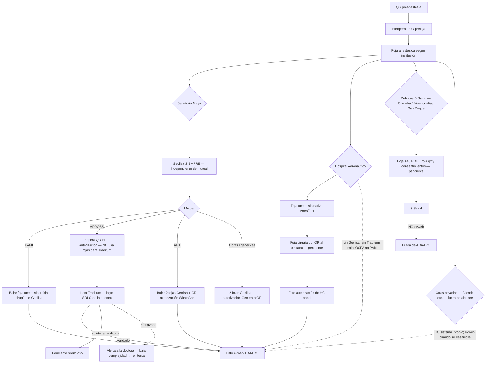

# Cierre de arquitectura — facturación (Preop → evweb × mutual)

Diseño cerrado. **No implementar desde este archivo.** Vive acá para que no quede solo en Downloads.

Fuentes: `cierre_arquitectura_pr7.md` (24-ago-2026) + charla del mismo día. Aclaración de capas HC vs facturación (31-ago-2026). Pendientes de consentimiento / foja quirúrgica / QR cirujano (31-ago-2026).

Relacionado: `docs/ARQUITECTURA_INSTITUCIONES.md` (patrones de **historia clínica** y `destino_final` del catálogo). Este doc cubre el **camino de facturación** encima de esa HC. El flujo actual de AnesFact no se redefine: se encadenan destinos. Quedan intactos `fill.js`, IDs GECLISA, forma de `S.cur`, `abrirInter` / `cargarFojaUI`.

---

## Idea en una frase

AnesFact es el tablero del caso. Geclisa es registro Mayo. Autorización es insumo de la mutual. Traditum es puente solo APROSS. evweb es el destino de facturación ADAARC. **No mezclar esos cuatro.**

## Aclaración de capas (corrige el brief original)

evweb **no** es de una institución particular: es la plataforma de **ADAARC** para facturación, usada por las **clínicas privadas en general**. Los públicos no facturan por ahí: van a **SISalud**.

Lo que varía por institución es el **sistema de historia clínica de fondo**:

- **Mayo** usa GECLISA. AnesFact inyecta ahí la foja con la extensión ya construida.
- **Aeronáutico** no tiene sistema de HC externo: su foja es 100 % nativa de AnesFact.

La inyección a GECLISA en Mayo ocurre **siempre**, sin importar la mutual. Lo que cambia según la mutual es **solo el camino posterior hacia evweb**: insumos que salen de GECLISA (la mayoría) vs puente **Traditum** (solo APROSS). “Directo desde GECLISA” **no** significa “sin autorización”: PAMI es el único que va a evweb con las dos fojas y nada más; ART y obras genéricas siguen necesitando autorización (QR o documentos en GECLISA). Ver matriz.

Catálogo SQL (`ARQUITECTURA_INSTITUCIONES.md`): Mayo tiene `tipo_sistema=geclisa` y `destino_final=geclisa`. Eso describe el **hito de HC**, no el de facturación ADAARC. No cambiar esa semilla en este lote. Facturación privada = evweb; pública = SISalud.

---

## Tronco común (todas las instituciones)

```
Anestesista genera QR preanestesia
        → paciente llena valoración
        → prefoja / estado Preoperatorio
        → día de cirugía: foja anestésica según el lugar
        → recién ahí se abren destinos (Geclisa / Traditum / evweb / SISalud)
```

El flujo de foja **no se redefine**. Destinos se encadenan encima.

## Diagrama institución × mutual



## Matriz (fuente de verdad operativa)

| Institución | Mutuales | Geclisa | Camino a facturación |
|---|---|---|---|
| **Aeronáutico** | solo **IOSFA** (no PAMI) | no existe | foja anestesia + foja cirugía (ambas nativas AnesFact) + foto autorización → **evweb** |
| **Mayo** | PAMI, APROSS, ART, obras varias | **siempre**, por institución, no por mutual | según fila de abajo |
| Mayo × **PAMI** | — | sí | 2 fojas Geclisa → evweb. Sin autorización aparte |
| Mayo × **APROSS** | — | sí (hito Mayo, no insumo Traditum) | QR PDF auth → parseo → Traditum → luego evweb |
| Mayo × **ART** | — | sí | 2 fojas Geclisa + QR autorización → evweb |
| Mayo × **obras genéricas** | — | sí | 2 fojas + autorización (Geclisa o QR) → evweb |
| **Públicos** (Córdoba, Misericordia, San Roque) | — | no | **SISalud**, no evweb |
| **Allende / sistema_propio** | — | no | HC propia. Destino evweb (privada) **cuando** exista flujo; hoy fuera de alcance |

### Aeronáutico (detalle)

Historia clínica en papel. Ambas fojas viven nativas en AnesFact (Geclisa no existe ahí):

```
Foja anestesia (AnesFact, ya existe) + Foja cirugía (AnesFact — pendiente)
                    ↓
        Foto de la autorización (único dato externo del caso)
                    ↓
              Listo para evweb
```

Sin Geclisa, sin Traditum. Se imprimen ambas fojas para la HC de papel; la versión digital en AnesFact es la que alimenta evweb.

Si un texto viejo dice “enviar a geclisa” en Aero, léase **evweb**.

---

## Tres QRs (no son el mismo)

| QR | Quién lo usa | Para qué | Estado |
|---|---|---|---|
| **Paciente / preanestesia** | Anestesista → paciente | Valoración → prefoja | En producción |
| **Recepción de documentos** | Secretaria / anestesista | Meter PDF de autorización (APROSS, ART, obras) al caso | Diseño; no hay módulo |
| **Cirujano / foja qx** | Anestesista → cirujano | Completar foja quirúrgica; queda copia para el anestesista | Pendiente (abajo) |

El QR cirujano es para lugares **sin GECLISA** (Aeronáutico y públicos). En Mayo la foja quirúrgica se **baja de GECLISA**, no la carga el cirujano por QR AnesFact.

---

## APROSS / Traditum (el que suele mezclarse)

Traditum **no** es otro Geclisa ni otro evweb. Es validar lo que APROSS autorizó.

- A Traditum va `cirugia_autorizada` (fila de prestaciones del PDF: código, fecha, estado por fila, N° TX). A foja/evweb clínico va `cirugia_clinica` (lo real). **No se concilian.**
- Parser: de la **fila de prestaciones**, no del diagnóstico del encabezado.
- PDF de autorización: extraer y **purgar**. Huérfanos → bandeja de la **doctora**.
- Usuario Traditum: **solo ella**, nunca secretaria.
- En el repo hoy: **0 líneas de Traditum**. Es diseño, no código.

```
enviado → validado            → pasa a listo_evweb
        → sujeto_a_auditoria  → espera pasiva, no bloquea el resto
        → rechazado           → ALERTA ACTIVA a la doctora
                                   → doctora decide una complejidad menor
                                   → reintenta envío
```

Anexo de campos del PDF Traditum: ver `cierre_arquitectura_pr7.md` en Downloads (tabla de prestaciones = fuente de `cirugia_autorizada`).

---

## Estados del caso (checklist, no un botón)

1. `geclisa_status` — Mayo: foja anestesia/cirugía hechas (si aplica al camino).
2. `auth_status` — sin_auth (PAMI) / pendiente_qr / parseada / (Traditum: enviado | validado | auditoría | rechazado).
3. `evweb_status` — no_listo → listo_evweb → enviado.

**Listo para evweb** = según mutual se cumplen los ítems de la matriz.

Otras decisiones del cierre PR7 (siguen vigentes, no codear ahora): dos cirugías el mismo día = dos casos; purge de autorización al confirmar extracción; foja 14 días post-`facturado`; rechazo cancela purge; alertas de cuota Supabase 70 % / 90 %.

## Home deseada (bandejas — no está implementada así)

Hoy Home es lista de fojas + hub Instituciones. El diseño del 24-ago pedía agrupar:

| Bandeja | Qué es |
|---------|--------|
| **Preoperatorio** | QR paciente / prefoja pendiente |
| **Autorizaciones** | Esperando QR PDF / parseadas / huérfanas |
| **Fojas** | Borrador · Listas · **En cola Geclisa** |
| **Listos Traditum** | APROSS listo para enviar / reintentar |
| **Pendientes Traditum** | Enviado · sujeto a auditoría · rechazado (alerta) |
| **Listos evweb** | Checklist completo según mutual |

Cualquier navegación nueva, si se llega a construir, pasa por `go(vista)`. No es este lote.

---

## Qué NO es esto

- Geclisa ≠ listo para evweb.
- evweb ≠ “el sistema de Mayo” ni “el sistema de Aero”. Es ADAARC; las privadas facturan ahí. Lo que cambia es la HC de fondo.
- Aero no pasa por Geclisa.
- SISalud (públicos) es otro destino; no entra a ADAARC/evweb. Pie ADAARC en papel SISalud se omite (ya en print).
- “Directo desde GECLISA” ≠ “sin autorización”, salvo PAMI.
- QR preop ≠ QR recepción de PDFs ≠ QR cirujano.
- Traditum no se opera con usuario de secretaria.
- Allende no se implementa en este esquema (patrón `sistema_propio` confirmado, flujo no).

---

## Pendientes registrados (sin implementar)

### 1. Consentimiento informado en el flujo del QR

El paciente lo trae firmado el día de la cirugía.

**BLOQUEADO** por revisión legal: validez de firma electrónica para consentimiento informado en Argentina / Córdoba es un área legalmente gris (hay fuentes contradictorias sobre si la Ley 26.742 lo excluye de digitalización). No implementar captura de firma digital hasta confirmación de un abogado especializado. Verificar con el abogado el número de ley citado.

Camino provisorio de bajo riesgo: firma manuscrita en papel + foto subida, mismo patrón que ya se usa para autorizaciones de mutual.

### 2. Foja quirúrgica

Para que cirujanos (Aeronáutico o públicos) carguen su foja, la impriman o suban a SISalud, junto con consentimientos.

En Mayo esta foja vive en GECLISA (se descarga para evweb). No duplicar un editor AnesFact para Mayo salvo decisión explícita.

### 3. QR del anestesista hacia el cirujano

Para que el cirujano complete la foja quirúrgica, y quede registrada también para el anestesista. Ámbito: Aeronáutico y públicos (sin GECLISA). No es el QR de valoración del paciente ni el de recepción de PDFs.

---

## Estado en código (hoy)

| Pieza | Código |
|---|---|
| QR preop → prefoja → foja | producción |
| Inyección GECLISA Mayo | extensión 0.5.x; nunca click en Guardar |
| Marca local evweb + nomenclador ADAARC | cosmética / copia; no hay fill de evweb |
| Traditum | 0 líneas |
| QR recepción auth / parser | no |
| Foja qx AnesFact + QR cirujano | no |
| Consentimiento (foto papel) | no (mismo hueco que auth) |
| Home por bandejas de facturación | no |
| SISalud upload | no investigar todavía |
